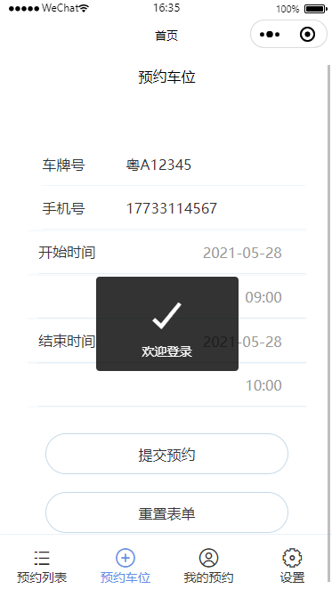
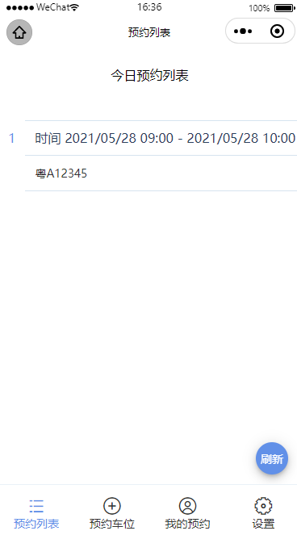
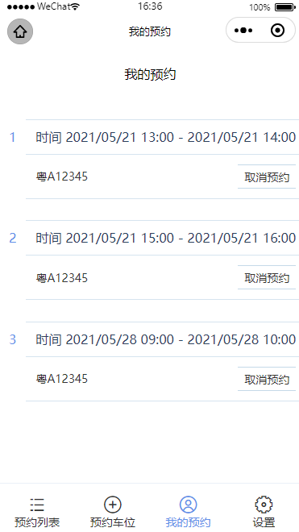

# reserve-parkingspace-mp

预约停车位 - 小程序

主要以微信小程序为主

# 主要技术

- taro
- react
- redux
- redux-thunk
- taro ui

# 主要功能

- 微信登录
- 获取微信用户信息
- 预约车位
- 预约列表
- 我的预约
- 取消预约
- 退出登录

# 使用示例

前端入口 src/app.jsx

```shell
# 运行
yarn dev:weapp

# 打包
yarn build:weapp
```

api 相关配置 src/api/index.js

# 示例图片

 
 

# 后端服务

https://github.com/dafengzhen/reserve-parkingspace

# 常用提交类型

```text
[
  'build',
  'chore',
  'ci',
  'docs',
  'feat',
  'fix',
  'perf',
  'refactor',
  'revert',
  'style',
  'test'
];
```

https://github.com/conventional-changelog/commitlint/tree/master/@commitlint/config-conventional
